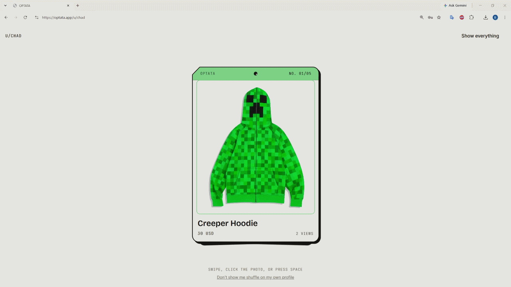
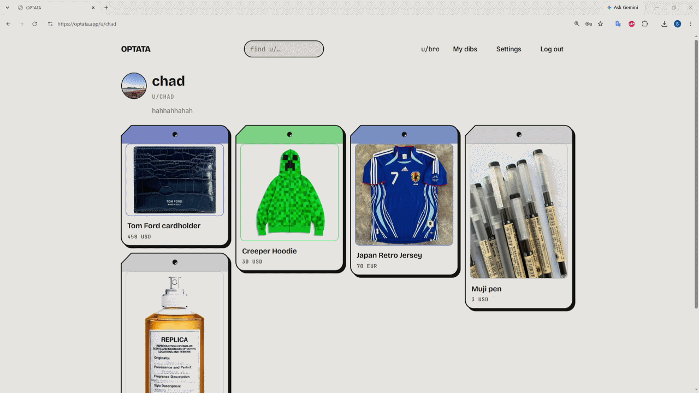
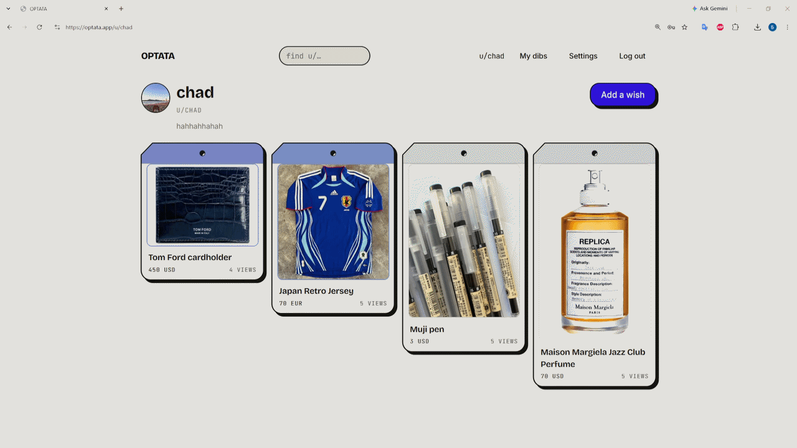
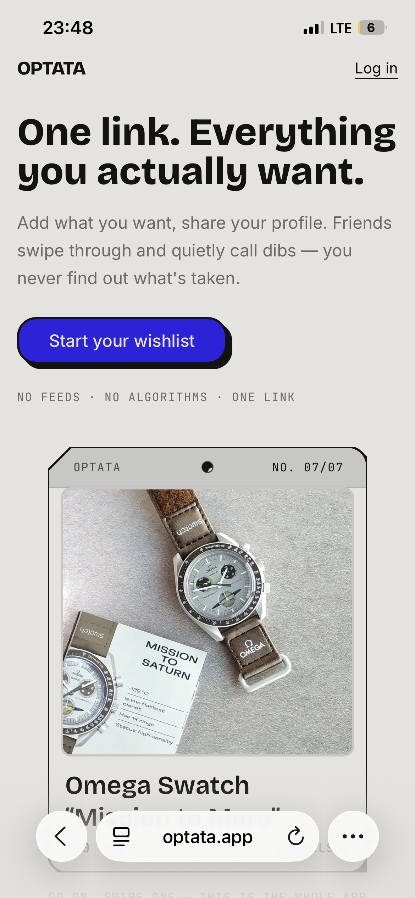
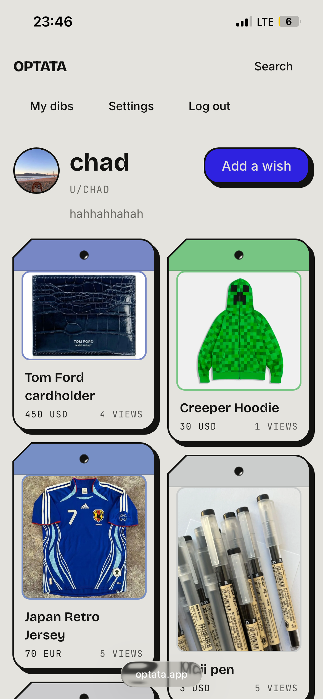
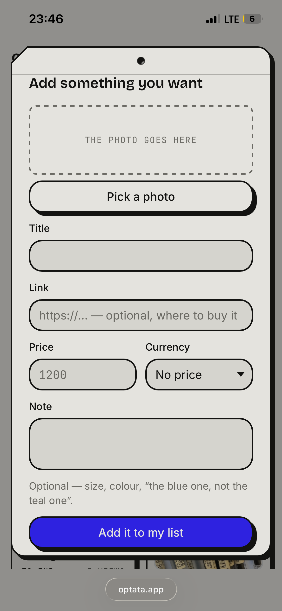
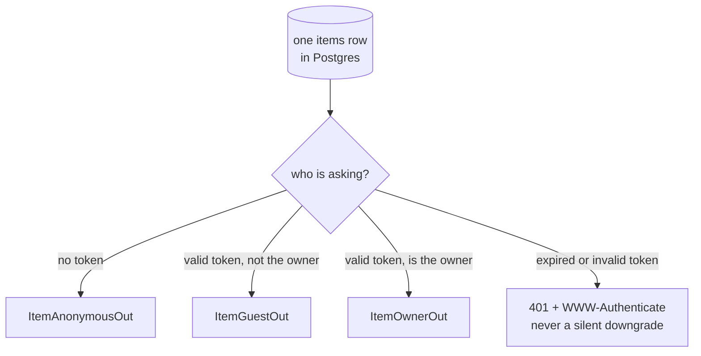
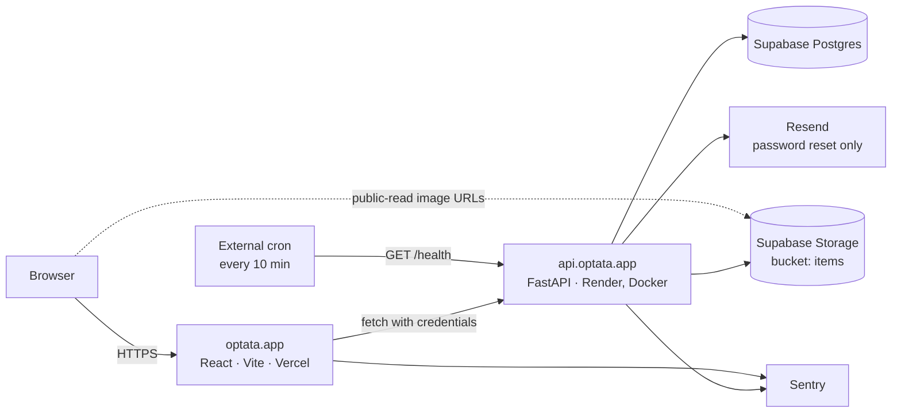
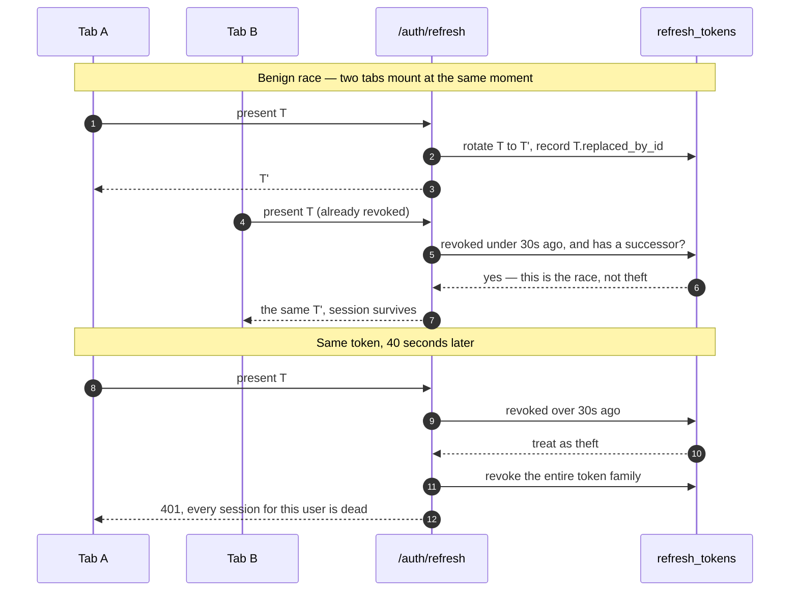
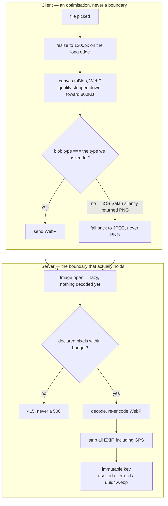

# OPTATA

**One link. Everything you actually want.**

A wishlist that hands your friends a deck of cards instead of a spreadsheet. You add what you
want; you share one link. Friends swipe through, open what catches their eye, and quietly call
dibs — and **you never find out what's taken**. The surprise survives.

**Live → [optata.app](https://optata.app)**



[How it works](#how-it-works) · [Demo](#demo) · [**The invariant**](#1-the-invariant) ·
[System overview](#system-overview) · [Stack](#stack) ·
[Architecture decisions](#architecture-decisions-and-why) · [Data model](#data-model) ·
[Testing](#testing) · [Operations](#operations) · [Limitations](#limitations--whats-next)

---

## How it works

You build a list of things you actually want — each one a photo, a price, a link. You share a
single URL and that is the entire distribution model: nothing to install, no account needed to
look. Friends reserve items so two of them don't buy the same thing, and that reservation is
visible to every other friend and to nobody else.

1. **Add items.** Paste a link, drop a photo. The image is compressed in the browser and the
   card's accent colour is pulled out of the photo itself.
2. **Share one link.** `optata.app/u/<you>`. Anyone can open it and swipe through the deck.
   Signing in is only required to reserve.
3. **Friends call dibs.** A reserved item is marked for other guests and untouched for you.
   The list you see is the list you wrote.

---

## Demo

### Reserving an item

A guest opens the link, picks a card, and calls dibs. The owner's view of that same item does
not change — not now, not later, not anywhere in the API. See [The invariant](#1-the-invariant).



### Adding an item

Upload a large photo → it is resized and re-encoded in the browser → the accent colour is
extracted from the image → the price tag repaints in that colour. Sections
[3](#3-the-image-pipeline-runs-on-the-client-and-the-server) and
[7](#7-the-tag-is-drawn-with-zero-measured-dimensions), running at once.



### On a phone

| Landing | Profile | Add item |
|---|---|---|
|  |  |  |

---

## 1. The invariant

**The owner of a wishlist must never learn that an item is reserved.**

That is not a feature of the product, it *is* the product — it is the thing that protects the
surprise. Everything else here is ordinary CRUD. This is the one place where the obvious
implementation is the wrong one, so it gets its own section.

One row in Postgres serializes four different ways, and which one you get is decided before any
data is touched:



| Field | Anonymous | Guest | Owner |
|---|:---:|:---:|:---:|
| `id`, `title`, `image_url`, `accent_color`, `link`, `price`, `currency`, `note`, `order_index` | ✓ | ✓ | ✓ |
| `is_reserved` | — | ✓ | **—** |
| `reserved_by_me` | — | ✓ | **—** |
| `view_count` | — | — | ✓ |

The diagram shows the fork; the table shows what disappears. The two bold dashes are the whole
product.

It is enforced with three separate Pydantic classes, not one class with optional fields:

```text
ItemAnonymousOut   id, title, image_url, accent_color, link, price, currency, note, order_index
ItemGuestOut     = ItemAnonymousOut + is_reserved + reserved_by_me
ItemOwnerOut     = ItemAnonymousOut + view_count
```

Three, not two, because **a logged-out owner is indistinguishable from a stranger**. "Let me
see how my wishlist looks to other people" is the most natural thing an owner will ever do —
they open an incognito window, and if anonymous responses carried `is_reserved`, every owner
would spoil their own surprise in week one. An anonymous viewer can't reserve anything anyway,
so the field buys them nothing and costs everything.

Why separate classes rather than `exclude=` or a conditional: a schema with escape hatches is a
schema that eventually leaks. Here, the field *does not exist on the class* — there is no code
path that can serialize it. There is also **no endpoint anywhere** that returns reservations on
items the caller owns; that route simply doesn't exist.

Pinned by tests that assert **key absence**, not values — including one that logs the owner out
and checks their own profile:

```python
assert "is_reserved" not in item_payload
assert "reserved_by_me" not in item_payload
```

A related trap, closed the same way: an *expired* owner token used to degrade silently to
anonymous, which would have served the owner the guest payload. Presenting a stale token now
returns `401` with `WWW-Authenticate: Bearer error="invalid_token"` so the client refreshes and
retries, rather than being quietly downgraded.

---

## System overview



Two deploy targets, one registrable domain, one database. The backend is the only process that
talks to Postgres — see [section 5](#5-no-rls-no-supabase-auth--the-backend-is-the-only-door).

---

## Stack

| Layer | Choice |
|---|---|
| Frontend | React 19 · Vite · TypeScript (strict) · Tailwind v4 · Framer Motion → **Vercel** |
| Backend | FastAPI · SQLAlchemy 2.0 (async) · Alembic · Pydantic v2 · uv → **Render** (Docker) |
| Data | **Supabase** Postgres + Supabase Storage |
| Email | **Resend** (password reset only) |
| Errors | Sentry (both ends, env-gated) |

App and API share one registrable domain — `optata.app` and `api.optata.app` — which is
load-bearing, not cosmetic. See
[Why the domain matters](#4-why-one-domain-and-not-vercelapp--onrendercom).

---

## Architecture decisions, and why

Seven decisions. [**1 is the invariant**](#1-the-invariant) — it is pulled up above the stack
table, ahead of everything else, because it is the only one of the seven that decides what the
product *is* rather than how it is built. The other six:

### 2. Refresh tokens: rotation with a 30-second grace window

Refresh tokens are opaque 32-byte values; only their SHA-256 is stored. Every `/auth/refresh`
rotates the token and revokes the old one. Presenting an **already-revoked** token is treated
as theft: the entire token family is revoked.

That's correct, and on its own it breaks real users. Browsers share one cookie jar across tabs,
so two tabs mounting at once both present the same token — and React StrictMode double-invokes
effects in development, doing it on every page load. Strict reuse detection reads this benign
race as theft and logs you out constantly.

So each token records `replaced_by_id`. Reuse of a token that was rotated **less than 30
seconds ago and has a recorded successor** is the race, not an attack:



This is the standard rotation-leeway tradeoff (Auth0 does the same) and it is a real tradeoff,
stated plainly: an attacker who steals a cookie and uses it within those 30 seconds gets a
valid pair instead of tripping the alarm. The alternative — logging out every user with two
tabs open — is worse.

The client half matters too: the refresh promise is **module-level and single-flight**, so
concurrent 401s, StrictMode double-mounts and parallel tabs produce exactly one network call,
coordinated across tabs with the Web Locks API.

### 3. The image pipeline runs on the client *and* the server



The client resizes to 1200px on the long edge, encodes WebP stepping quality down toward
≤800KB, and extracts the accent colour from a 32×32 downsample of the same canvas.

**Why the codec is chosen by inspecting the output, not the user agent:** `canvas.toBlob` does
not return `null` for a format it cannot encode — it silently returns a **PNG**. iOS Safari
does exactly that for WebP, and PNG is lossless, so every "step the quality down" retry returns
a byte-identical 2.5MB file. Checking `blob === null` therefore detects nothing. The pipeline
compares `blob.type` to the type it asked for, and falls back to JPEG — never PNG — the moment
they differ. That is also why the server limit is 1MB and not 500KB: a browser with no WebP
encoder legitimately sends a larger JPEG.

**Why client-side at all:** Supabase's free tier is 1GB. What lands in storage is the server's
re-encoded WebP — around 300KB — so 40 items is ~12MB/user (~80 users); uncompressed it's ~20
users. Render's free instance also has no CPU budget to spare for image processing.

**Why the server still re-encodes anyway** — this is the important half. The client pipeline is
an *optimisation*, never a security boundary: anything a browser does can be skipped by a
`curl`. So the server independently opens every upload with Pillow and re-saves it, which:

1. proves the bytes are a real image and not a polyglot,
2. **strips all EXIF, including GPS** — people photograph wishes at home, and without this
   their address ships inside the file,
3. enforces a hard pixel budget. A ~300KB PNG can declare 12000×12000 in its header: ~576MB of
   RGBA once decoded, on a 512MB instance. `Image.open()` is lazy, so dimensions are checked
   *before* any decode, and `MAX_IMAGE_PIXELS` is pinned to the same budget (Pillow's default is
   calibrated for a desktop, not a small container). Any Pillow failure on user input returns
   415, never a 500.

Storage keys are immutable: `{user_id}/{item_id}/{uuid4}.webp`. Replacing a photo writes a
**new** key and deletes the old object, so a CDN can never serve a stale or deleted image from a
recycled URL. Deleting an item removes the storage object *first*, then the row — an orphaned
file is harmless, an orphaned row is not.

### 4. Why one domain, and not `*.vercel.app` + `*.onrender.com`

The refresh token lives in an httpOnly cookie. Where that cookie is set decides whether the app
works on half the phones in the world:

| | Frontend on `vercel.app`, API on `onrender.com` | `optata.app` + `api.optata.app` |
|---|---|---|
| The refresh cookie is | **third-party** | **first-party** |
| Safari (ITP) | blocked outright | works |
| Brave | blocked | works |
| Chrome | narrowing it | works |
| `SameSite` needed | `None; Secure`, and still blocked above | `Lax` |
| Transport | ordinary TLS | `.app` is HSTS-preloaded — HTTPS by construction |
| Failure mode | perfect in desktop Chrome while every iPhone user is silently logged out after the first refresh | — |

`optata.app` and `api.optata.app` share a registrable domain, so `SameSite=Lax` with
`COOKIE_DOMAIN=.optata.app` is first-party everywhere. The nasty part of the left column is not
that it fails — it's that it fails *invisibly*, on someone else's device, after the demo.

### 5. No RLS, no Supabase Auth — the backend is the only door

Supabase's Data API (PostgREST) is **disabled**, and the `anon`/`authenticated` roles are
stripped of privileges on `public`. Auth is ours: argon2id + our own JWTs. The API connects as
the `postgres` role and is the only path to the data.

Why not RLS: [the invariant](#1-the-invariant) isn't row-level, it's **field-level and
viewer-dependent** — the same row must serialize differently for three kinds of viewer. RLS
decides which *rows* you may read; it cannot express "this column does not exist for you".
Enforcing it in one serialization layer, pinned by key-absence tests, is both truthful to the
requirement and far easier to audit than policies split across two systems.

The Storage bucket is public-read (anonymous visitors must load photos by URL), but **listing is
denied**: RLS is enabled on `storage.objects` with zero policies, so `anon` and `authenticated`
both read zero rows. Verified by impersonating the roles in the database — `storage.search()`
and `list_objects_with_delimiter()` return nothing — and over HTTP, where the list endpoint 400s
without credentials while a direct object URL still serves. The unguessable `{uuid4}` in every
key is what keeps objects private in practice.

### 6. Rate limiting keys on the *real* client IP

Limits: login 10/min, register 5/hour, forgot-password 3/hour, `POST /items` 60/hour.

Two dimensions, not one: login and forgot-password are limited **per IP and per submitted
email**. Behind a proxy or CGNAT (most mobile users in Poland and Ukraine share public IPs),
IP-only limiting either lumps everyone together or is trivially evaded. Stated tradeoff:
per-email limiting enables a targeted lockout against a known account — acceptable at these
thresholds and this scale, but a real cost, not a free win.

The client IP comes from `ProxyHeadersMiddleware` with an explicit trust list. **Never set
`FORWARDED_ALLOW_IPS=*`**: with `*`, uvicorn takes the *leftmost* — attacker-controlled —
`X-Forwarded-For` entry, which turns rate limiting into a formality. With an explicit list it
takes the rightmost untrusted entry, which is the real client. Pinned by tests asserting the
parse direction and that spoofing from an untrusted peer changes nothing.

### 7. The tag is drawn with zero measured dimensions

Every surface in the app is a *price tag*: 2px ink outline, 18px radius, offset shadow with no
blur, an angled top-left corner and a real punched hole. It's one SVG that sizes itself via CSS
percentages and a drop-shadow filter — no `ResizeObserver`, no measure-then-paint. An earlier
version measured its container first, which meant it rendered blank until layout settled and
could be starved entirely (`content-visibility` did exactly that). Now it is correct on first
paint, before any photo or layout arrives — guarded by a test that mounts it in jsdom, where
there is no layout engine at all.

---

## Data model

Four tables. The shape, not the DDL:

```text
users            id · username (unique, the /u/<username> handle) · email (unique)
                 · password_hash (argon2id) · created_at
items            id · user_id → users · title · image_url · accent_color · link
                 · price · currency · note · order_index · view_count · created_at
reservations     id · item_id → items (unique — one live reservation per item)
                 · user_id → users · created_at
refresh_tokens   id · user_id → users · token_hash (sha256, never the token)
                 · replaced_by_id → refresh_tokens · revoked_at · expires_at · created_at
```

Two things worth noticing. `is_reserved` and `reserved_by_me` are **not columns** — they are
derived from `reservations` at serialization time, only for the viewers entitled to them, which
is why [the invariant](#1-the-invariant) is enforceable at all. And `refresh_tokens.replaced_by_id`
is the self-reference that makes the grace window in
[section 2](#2-refresh-tokens-rotation-with-a-30-second-grace-window) possible: it is what
distinguishes "rotated a moment ago" from "replayed".

Deletes cascade from `users` to items, reservations and tokens. Storage does not cascade — see
[Operations](#operations).

---

## Testing

**55 backend · 62 frontend.** The backend suite runs against a **real Postgres**, not SQLite and
not a mock, each test inside a transaction that is rolled back, so it never leaves rows behind.

What the suite is actually for — every non-obvious decision above has a test whose job is to
fail if someone later "simplifies" it:

| Pinned | Why it would otherwise rot |
|---|---|
| **Key absence** in all three item schemas — `assert "is_reserved" not in payload` | The one that matters. Asserting on *values* would pass on a payload that leaks the key as `null` |
| A **logged-out owner** viewing their own profile | The incognito case — the one every owner tries first |
| An **expired owner token** returns 401 | A silent downgrade to anonymous is a leak wearing a valid status code |
| Refresh **inside** the grace window converges on one token | A regression here logs out every user with two tabs |
| Refresh **outside** it revokes the whole family | A regression here turns theft detection off |
| `X-Forwarded-For` **parse direction**, and that spoofing from an untrusted peer changes nothing | An off-by-one here silently disables rate limiting |
| The tag renders correctly **in jsdom**, where there is no layout engine | Proves first-paint correctness without any measurement |
| Hostile image input returns **415**, never 500 | A 500 here means a decode that should never have started |

```bash
cd backend && uv run pytest
```

```bash
cd frontend && npm test
```

---

## Operations

- **Keep-alive:** Render free sleeps after 15 minutes (~50s cold start) and Supabase pauses
  after 7 days idle. An external cron pings `GET /health` every 10 minutes; `/health` runs
  `SELECT 1`, so one ping keeps both awake. The frontend also shows an honest
  "Waking the server up…" state for any request over 3 seconds instead of a dead spinner.
- **Deleting a user** (abuse reports, GDPR-style requests):

  ```bash
  cd backend
  uv run python scripts/delete_user.py <username> --dry-run   # show, change nothing
  uv run python scripts/delete_user.py <username>             # asks for confirmation
  ```

  DB cascades handle items, reservations and tokens. Storage does **not** cascade, so the script
  deletes every object under the user's prefix first and aborts without touching the row if any
  object survives.
- **Migrations** run from the container entrypoint before uvicorn starts. If a migration fails
  the container exits non-zero, the deploy goes red, and the previous version keeps serving —
  the app never boots against an un-migrated database.

---

## Limitations & what's next

Where I already know this is thin:

- **No email verification at signup.** Registration accepts an address and trusts it; the only
  mail that ever goes out is a password reset. You can sign up with an address you don't own.
  Rate limiting (5/hour per IP) makes that slow, not impossible. First thing to fix.
- **The 30-second refresh window is a deliberate hole.** Documented in
  [section 2](#2-refresh-tokens-rotation-with-a-30-second-grace-window) rather than hidden: a
  stolen cookie replayed inside that window gets a valid pair instead of tripping the alarm.
  Binding rotation to a device fingerprint would let the window shrink toward zero.
- **Per-email rate limiting enables targeted lockout.** Someone who knows your address can hold
  your login at the limit. Chosen over the alternative, but it is a cost, not a free win.
- **Image privacy rests on unguessable keys, not on authorization.** The bucket is public-read;
  listing is denied and the `uuid4` is unguessable, but anyone handed a URL keeps it until the
  item is deleted. Signed, short-lived URLs are the real answer.
- **Free-tier ceilings are real.** ~1GB of Supabase storage is roughly 80 users at 40 items
  each; Render's cold start is ~50s whenever the cron misses. The keep-alive mitigates this, it
  does not remove it.
- **No reservation expiry.** A guest who reserves and never buys holds the item indefinitely;
  only they can release it.

---

<details>
<summary><strong>Local setup</strong> — prerequisites, running both halves, environment variables</summary>

<br>

**Prerequisites:** Python 3.13+, Node 20+, [uv](https://docs.astral.sh/uv/), and a Supabase
project (Postgres + a public Storage bucket named `items`).

```bash
# backend
cd backend
cp .env.example .env          # fill DATABASE_URL, JWT_SECRET, SUPABASE_*, RESEND_API_KEY
uv sync
uv run alembic upgrade head
uv run uvicorn app.main:app --reload --port 8000
```

```bash
# frontend (second terminal)
cd frontend
cp .env.example .env          # VITE_API_BASE_URL=http://localhost:8000
npm install
npm run dev
```

### Environment variables

**Backend** (`backend/.env`, or the Render dashboard in production)

| Variable | Purpose |
|---|---|
| `DATABASE_URL` | Supabase Postgres, session pooler, `postgresql+asyncpg://…` |
| `JWT_SECRET` | Signs 15-minute access tokens. `openssl rand -hex 32`; a *different* one per environment |
| `SUPABASE_URL` | `https://<ref>.supabase.co` |
| `SUPABASE_SERVICE_KEY` | service_role key. **Backend only** — never a `VITE_` var, never in a response |
| `RESEND_API_KEY` | Password-reset email |
| `EMAIL_FROM` | Must be on the Resend-verified domain or sends bounce |
| `FRONTEND_ORIGIN` | Comma-separated CORS allow-list; the **first** is canonical and used in reset links |
| `COOKIE_SECURE` / `COOKIE_SAMESITE` / `COOKIE_DOMAIN` | Refresh-cookie flags. Config, never `if env == "prod"` |
| `FORWARDED_ALLOW_IPS` | Proxy peers trusted for `X-Forwarded-For`. **Never `*`** — see [section 6](#6-rate-limiting-keys-on-the-real-client-ip) |
| `DEBUG_WHOAMI` | `true` exposes `GET /debug/whoami` for the proxy audit. Off by default |
| `SENTRY_DSN` | Empty disables Sentry entirely |

**Frontend** (`frontend/.env`, or the Vercel dashboard)

| Variable | Purpose |
|---|---|
| `VITE_API_BASE_URL` | API origin. **Baked in at build time** — changing it needs a redeploy |
| `VITE_SENTRY_DSN` | Empty disables Sentry entirely |

</details>

---

## License

[MIT](LICENSE).

## Author

Bohdan Storozh — [github.com/fabulanova](https://github.com/fabulanova) · bodiastorozh@gmail.com
