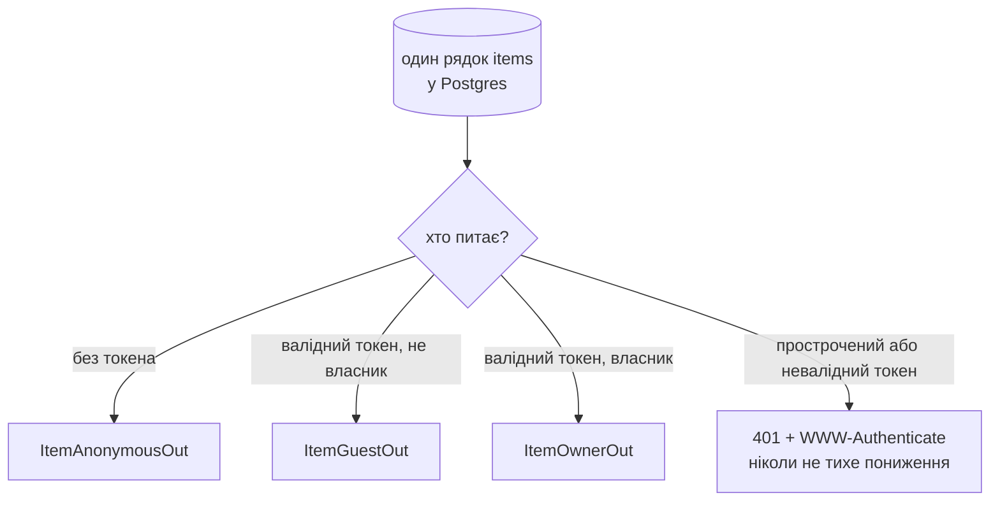
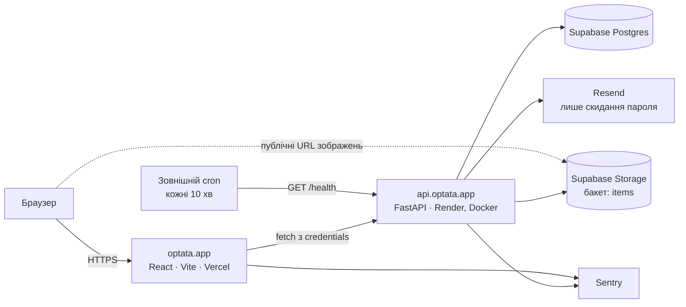
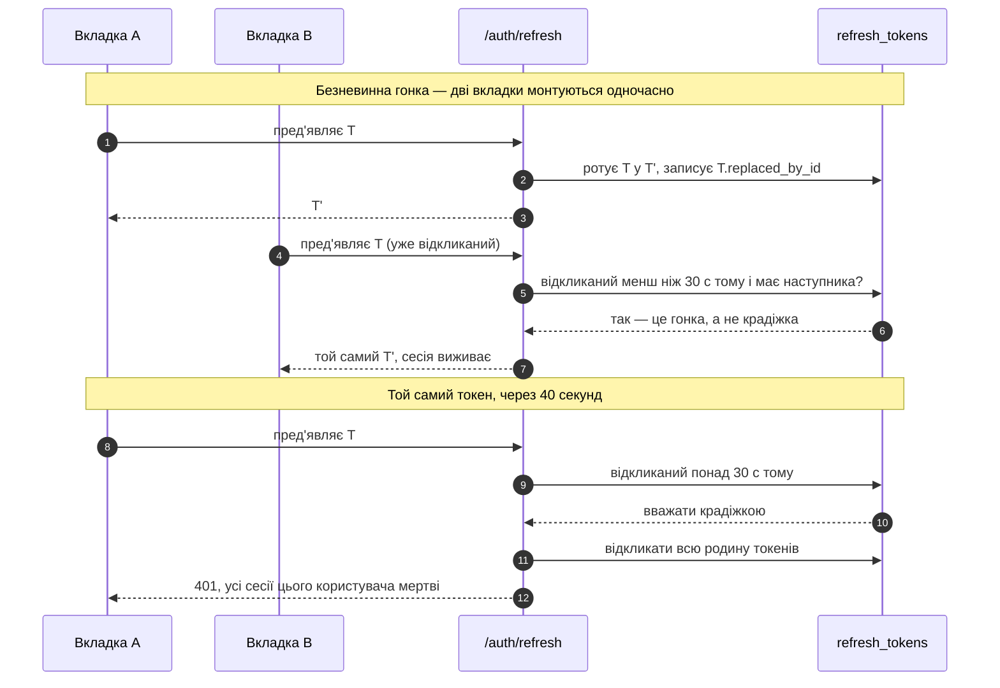
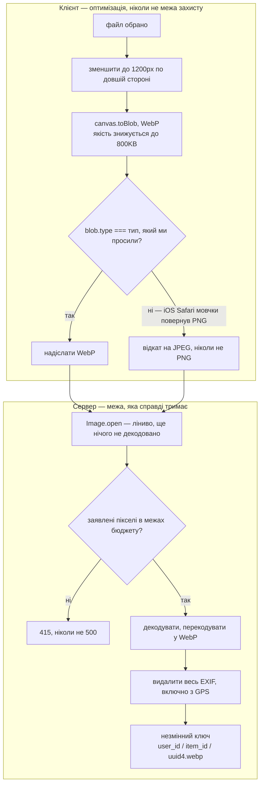

<p align="right">
  <a href="README.md"></a>
  <a href="README.uk.md"></a>
</p>

# OPTATA

**Одне посилання. Усе, чого ти справді хочеш.**

Вішліст, який дає друзям колоду карток замість таблиці. Ти додаєш те, чого хочеш, і ділишся одним
посиланням. Друзі гортають колоду, відкривають те, що зачепило, і тихенько бронюють — а **ти
ніколи не дізнаєшся, що вже зайнято**. Сюрприз живе.

**Живе демо → [optata.app](https://optata.app)**


[Як це працює](#як-це-працює) · [Демо](#демо) · [**Інваріант**](#1-інваріант) ·
[Огляд системи](#огляд-системи) · [Стек](#стек) ·
[Архітектурні рішення](#архітектурні-рішення-і-чому-саме-так) · [Модель даних](#модель-даних) ·
[Тестування](#тестування) · [Експлуатація](#експлуатація) · [Обмеження](#обмеження-і-що-далі)

---

## Як це працює

Ти складаєш список речей, яких справді хочеш: у кожної є фото, ціна й посилання. Ділишся однією
URL-адресою, і це вся модель поширення: нічого не треба встановлювати, для перегляду не потрібен
акаунт. Друзі бронюють речі, щоб двоє не купили те саме, і це бронювання бачать усі інші друзі — і
більше ніхто.

1. **Додай речі.** Встав посилання, кинь фото. Зображення стискається в браузері, а колір акценту
   картки береться з самого фото.
2. **Поділися одним посиланням.** `optata.app/u/<you>`. Будь-хто може відкрити його й гортати
   колоду. Увійти треба лише для того, щоб забронювати.
3. **Друзі бронюють.** Заброньована річ позначена для інших гостей і незмінна для тебе. Список,
   який ти бачиш, — це список, який ти написав.

---

## Демо

### Бронювання речі

Гість відкриває посилання, обирає картку й бронює. Те, як цю саму річ бачить власник, не
змінюється — ні зараз, ні пізніше, ні деінде в API. Див. [Інваріант](#1-інваріант).


### Додавання речі

Завантажуєш велике фото → воно зменшується й перекодовується в браузері → з нього витягується
колір акценту → цінник перефарбовується в цей колір. Розділи
[3](#3-обробка-зображень-працює-і-на-клієнті-і-на-сервері) і
[7](#7-цінник-малюється-без-жодного-виміряного-розміру) працюють одночасно.


### На телефоні

| Головна | Профіль | Додавання речі |
|---|---|---|
|  |  |  |

---

## 1. Інваріант

**Власник вішліста ніколи не повинен дізнатися, що річ заброньовано.**

Це не функція продукту, це *і є* продукт — саме це береже сюрприз. Усе інше тут — звичайний CRUD.
Це єдине місце, де очевидна реалізація неправильна, тому воно має окремий розділ.

Один рядок у Postgres серіалізується чотирма різними способами, і який саме ти отримаєш,
вирішується до того, як зачеплено будь-які дані:



| Поле | Анонім | Гість | Власник |
|---|:---:|:---:|:---:|
| `id`, `title`, `image_url`, `accent_color`, `link`, `price`, `currency`, `note`, `order_index` | ✓ | ✓ | ✓ |
| `is_reserved` | — | ✓ | **—** |
| `reserved_by_me` | — | ✓ | **—** |
| `view_count` | — | — | ✓ |

Діаграма показує розгалуження, таблиця — що зникає. Два жирні прочерки — це весь продукт.

Це забезпечено трьома окремими класами Pydantic, а не одним класом з опційними полями:

```text
ItemAnonymousOut   id, title, image_url, accent_color, link, price, currency, note, order_index
ItemGuestOut     = ItemAnonymousOut + is_reserved + reserved_by_me
ItemOwnerOut     = ItemAnonymousOut + view_count
```

Три, а не два, бо **власник, який вийшов з акаунта, нічим не відрізняється від незнайомця**.
«Подивлюся, як мій вішліст бачать інші» — найприродніше, що власник колись зробить: він відкриває
вікно інкогніто, і якби анонімні відповіді містили `is_reserved`, кожен власник зіпсував би собі
сюрприз уже в перший тиждень. Анонім однаково нічого не може забронювати, тож це поле нічого йому
не дає, а коштує все.

Чому окремі класи, а не `exclude=` чи умова: схема з обхідними шляхами — це схема, яка рано чи
пізно протече. Тут поля *немає в класі* — у коді немає жодного шляху, який міг би його
серіалізувати. І **немає жодного ендпоінта**, який повертав би бронювання речей, що належать тому,
хто питає; такого маршруту просто не існує.

Закріплено тестами, які перевіряють **відсутність ключа**, а не значення, — зокрема тестом, який
розлогінює власника й перевіряє його власний профіль:

```python
assert "is_reserved" not in item_payload
assert "reserved_by_me" not in item_payload
```

Суміжну пастку закрито так само: *прострочений* токен власника раніше тихо понижувався до
анонімного, і власник отримав би гостьовий payload. Тепер прострочений токен повертає `401` з
`WWW-Authenticate: Bearer error="invalid_token"`, щоб клієнт оновив токен і повторив запит, а не
був тихо понижений.

---

## Огляд системи



Два місця деплою, один домен, одна база даних. Бекенд — єдиний процес, який говорить із Postgres,
— див. [розділ 5](#5-без-rls-і-supabase-auth--бекенд-як-єдині-двері).

---

## Стек

| Шар | Вибір |
|---|---|
| Фронтенд | React 19 · Vite · TypeScript (strict) · Tailwind v4 · Framer Motion → **Vercel** |
| Бекенд | FastAPI · SQLAlchemy 2.0 (async) · Alembic · Pydantic v2 · uv → **Render** (Docker) |
| Дані | **Supabase** Postgres + Supabase Storage |
| Пошта | **Resend** (лише скидання пароля) |
| Помилки | Sentry (з обох боків, вмикається змінною середовища) |

Застосунок і API живуть на одному домені — `optata.app` і `api.optata.app` — і це несуча
конструкція, а не косметика. Див.
[Чому домен важливий](#4-чому-один-домен-а-не-vercelapp--onrendercom).

---

## Архітектурні рішення і чому саме так

Сім рішень. [**Перше — інваріант**](#1-інваріант): його винесено вище за таблицю стеку, перед
усім іншим, бо це єдине з семи, яке визначає, *чим* є продукт, а не як його збудовано. Інші шість:

### 2. Refresh-токени: ротація з 30-секундним вікном

Refresh-токени — непрозорі 32-байтові значення; зберігається лише їхній SHA-256. Кожен
`/auth/refresh` ротує токен і відкликає старий. Пред'явлення **вже відкликаного** токена
вважається крадіжкою: відкликається вся родина токенів.

Це правильно, але саме по собі ламає життя реальним користувачам. Браузер ділить одне сховище
cookie між усіма вкладками, тож дві вкладки, що монтуються одночасно, пред'являють той самий токен.
А React StrictMode у розробці викликає ефекти двічі й робить це на кожному завантаженні сторінки.
Сувора перевірка повторного використання сприймає цю безневинну гонку як крадіжку й постійно
тебе розлогінює.

Тому кожен токен записує `replaced_by_id`. Повторне використання токена, який ротовано **менш ніж
30 секунд тому і який має записаного наступника**, — це гонка, а не атака:



Це стандартний компроміс із запасом часу на ротацію (Auth0 робить так само), і це справжній
компроміс, названий прямо: зловмисник, який вкраде cookie й використає її протягом цих 30 секунд,
отримає валідну пару замість того, щоб підняти тривогу. Альтернатива — розлогінювати кожного
користувача з двома відкритими вкладками — гірша.

Клієнтська половина теж важлива: проміс оновлення **живе на рівні модуля і завжди один
(single-flight)**, тож паралельні 401, подвійні монтування StrictMode і паралельні вкладки дають
рівно один мережевий запит, узгоджений між вкладками через Web Locks API.

### 3. Обробка зображень працює і на клієнті, *і* на сервері



Клієнт зменшує фото до 1200px по довшій стороні, кодує у WebP, крок за кроком знижуючи якість до
≤800KB, і витягує колір акценту з копії того самого canvas, зменшеної до 32×32.

**Чому кодек обирається за перевіркою результату, а не за user agent:** `canvas.toBlob` не
повертає `null` для формату, який не вміє кодувати, — він мовчки повертає **PNG**. iOS Safari
робить саме так із WebP, а PNG — формат без втрат, тож кожна спроба «знизити якість» повертає
побайтово той самий файл на 2.5MB. Тому перевірка `blob === null` нічого не виявляє. Пайплайн
порівнює `blob.type` з типом, який просив, і щойно вони розходяться, переходить на JPEG — ніколи
не на PNG. Через це ж ліміт на сервері 1MB, а не 500KB: браузер без WebP-кодера цілком законно
надсилає більший JPEG.

**Навіщо взагалі на клієнті:** безкоштовний тариф Supabase — 1GB. У сховище потрапляє
перекодований сервером WebP, близько 300KB, тож 40 речей — це ~12MB на користувача (~80
користувачів); без стиснення — ~20 користувачів. До того ж безкоштовний інстанс Render не має
зайвого CPU на обробку зображень.

**Чому сервер однаково перекодовує** — і це важливіша половина. Клієнтський пайплайн — це
*оптимізація*, ніколи не межа захисту: усе, що робить браузер, можна обійти одним `curl`. Тому
сервер незалежно відкриває кожне завантаження через Pillow і зберігає його заново, що:

1. доводить, що байти — справжнє зображення, а не поліглот,
2. **видаляє весь EXIF, включно з GPS** — люди фотографують бажане вдома, і без цього їхня адреса
   їде всередині файлу,
3. накладає жорсткий бюджет пікселів. PNG на ~300KB може заявити в заголовку 12000×12000: це
   ~576MB RGBA після декодування на інстансі з 512MB. `Image.open()` лінивий, тож розміри
   перевіряються *до* будь-якого декодування, а `MAX_IMAGE_PIXELS` прив'язано до того самого
   бюджету (значення Pillow за замовчуванням розраховане на десктоп, а не на маленький контейнер).
   Будь-яка помилка Pillow на даних користувача повертає 415, ніколи не 500.

Ключі в сховищі незмінні: `{user_id}/{item_id}/{uuid4}.webp`. Заміна фото записує **новий** ключ
і видаляє старий об'єкт, тож CDN ніколи не віддасть застаріле чи видалене зображення з повторно
використаної URL-адреси. Видалення речі *спершу* прибирає об'єкт зі сховища, а потім рядок:
осиротілий файл нешкідливий, осиротілий рядок — ні.

### 4. Чому один домен, а не `*.vercel.app` + `*.onrender.com`

Refresh-токен живе в httpOnly cookie. Те, де встановлено цю cookie, вирішує, чи працюватиме
застосунок на половині телефонів світу:

| | Фронтенд на `vercel.app`, API на `onrender.com` | `optata.app` + `api.optata.app` |
|---|---|---|
| Refresh-cookie | **стороння (third-party)** | **своя (first-party)** |
| Safari (ITP) | блокується повністю | працює |
| Brave | блокується | працює |
| Chrome | поступово обмежує | працює |
| Потрібен `SameSite` | `None; Secure`, і все одно блокується вище | `Lax` |
| Транспорт | звичайний TLS | `.app` є в HSTS preload — HTTPS за побудовою |
| Як ламається | ідеально в десктопному Chrome, поки кожного користувача iPhone тихо розлогінює після першого оновлення токена | — |

`optata.app` і `api.optata.app` мають спільний реєстрований домен, тож `SameSite=Lax` з
`COOKIE_DOMAIN=.optata.app` — first-party всюди. Найгірше в лівій колонці не те, що вона
ламається, а те, що ламається *непомітно*, на чужому пристрої, вже після демо.

### 5. Без RLS і Supabase Auth — бекенд як єдині двері

Data API Supabase (PostgREST) **вимкнено**, а ролі `anon`/`authenticated` позбавлені привілеїв на
`public`. Автентифікація своя: argon2id + власні JWT. API підключається під роллю `postgres` і є
єдиним шляхом до даних.

Чому не RLS: [інваріант](#1-інваріант) не рядковий, він **на рівні полів і залежить від того, хто
дивиться** — той самий рядок має серіалізуватися по-різному для трьох типів глядачів. RLS вирішує,
які *рядки* тобі можна читати; він не може виразити «цієї колонки для тебе не існує». Забезпечити
це в одному шарі серіалізації, закріпленому тестами на відсутність ключів, — і чесніше щодо
вимоги, і значно простіше для аудиту, ніж політики, розкидані по двох системах.

Бакет Storage публічний на читання (анонімні відвідувачі мають завантажувати фото за URL), але
**перелік заборонено**: на `storage.objects` увімкнено RLS без жодної політики, тож і `anon`, і
`authenticated` читають нуль рядків. Перевірено імперсонацією ролей у базі — `storage.search()` і
`list_objects_with_delimiter()` нічого не повертають — і через HTTP, де ендпоінт переліку без
облікових даних повертає 400, а пряма URL-адреса об'єкта й далі віддається. На практиці об'єкти
приватними тримає непередбачуваний `{uuid4}` у кожному ключі.

### 6. Rate limiting за справжньою IP-адресою клієнта

Ліміти: логін 10/хв, реєстрація 5/год, forgot-password 3/год, `POST /items` 60/год.

Два виміри, а не один: логін і forgot-password обмежено **за IP і за введеним email**. За проксі
чи CGNAT (більшість мобільних користувачів у Польщі й Україні ділять публічні IP) ліміт лише за
IP або зганяє всіх докупи, або тривіально обходиться. Названий компроміс: ліміт за email дозволяє
цілеспрямовано заблокувати відомий акаунт — прийнятно за таких порогів і такого масштабу, але це
справжня ціна, а не безкоштовний виграш.

IP клієнта береться з `ProxyHeadersMiddleware` з явним списком довірених адрес. **Ніколи не став
`FORWARDED_ALLOW_IPS=*`**: з `*` uvicorn бере *крайній лівий* запис `X-Forwarded-For`, який
контролює атакувальник, і rate limiting перетворюється на формальність. З явним списком береться
крайній правий недовірений запис, тобто справжній клієнт. Закріплено тестами, які перевіряють
напрям розбору і те, що підробка від недовіреного вузла нічого не змінює.

### 7. Цінник малюється без жодного виміряного розміру

Кожна поверхня в застосунку — *цінник*: контур 2px, радіус 18px, зміщена тінь без розмиття,
скошений верхній лівий кут і справжня пробита дірка. Це один SVG, який задає собі розмір через
відсотки CSS і фільтр drop-shadow — без `ResizeObserver`, без «спершу виміряй, потім намалюй».
Рання версія спершу вимірювала контейнер, тож була порожньою, доки не встановиться верстка, і могла
не дочекатися її взагалі (саме це й зробив `content-visibility`). Тепер вона правильна з першого
кадру, ще до того, як прийшли фото чи верстка. Це охороняє тест, який монтує цінник у jsdom, де
рушія верстки немає взагалі.

---

## Модель даних

Чотири таблиці. Форма, а не DDL:

```text
users            id · username (унікальний, хендл у /u/<username>) · email (унікальний)
                 · password_hash (argon2id) · created_at
items            id · user_id → users · title · image_url · accent_color · link
                 · price · currency · note · order_index · view_count · created_at
reservations     id · item_id → items (унікальний — одне активне бронювання на річ)
                 · user_id → users · created_at
refresh_tokens   id · user_id → users · token_hash (sha256, ніколи не сам токен)
                 · replaced_by_id → refresh_tokens · revoked_at · expires_at · created_at
```

Дві речі, варті уваги. `is_reserved` і `reserved_by_me` — **не колонки**: вони виводяться з
`reservations` під час серіалізації і лише для тих, кому їх можна бачити, — саме тому
[інваріант](#1-інваріант) взагалі можна забезпечити. А `refresh_tokens.replaced_by_id` — це
самопосилання, яке робить можливим вікно з
[розділу 2](#2-refresh-токени-ротація-з-30-секундним-вікном): саме воно відрізняє «ротовано щойно»
від «відтворено повторно».

Видалення каскадно йдуть від `users` до речей, бронювань і токенів. Сховище каскадно не
видаляється — див. [Експлуатація](#експлуатація).

---

## Тестування

**55 бекенд · 62 фронтенд.** Бекенд-тести працюють на **справжньому Postgres**, не на SQLite і не
на моку; кожен тест виконується в транзакції, яку потім відкочують, тож рядків після себе він не
лишає.

Для чого насправді цей набір: у кожного неочевидного рішення вище є тест, чия робота — впасти,
якщо хтось пізніше це рішення «спростить».

| Закріплено | Чому інакше зіпсувалося б |
|---|---|
| **Відсутність ключа** в усіх трьох схемах речі — `assert "is_reserved" not in payload` | Найважливіший. Перевірка *значень* пройшла б на payload, який зливає ключ як `null` |
| **Власник, що вийшов з акаунта**, дивиться свій профіль | Випадок інкогніто — перше, що пробує кожен власник |
| **Прострочений токен власника** повертає 401 | Тихе пониження до аноніма — це витік з валідним статус-кодом |
| Оновлення **всередині** вікна сходиться до одного токена | Регресія тут розлогінить кожного, хто має дві вкладки |
| Оновлення **поза** вікном відкликає всю родину | Регресія тут вимкне виявлення крадіжки |
| **Напрям розбору** `X-Forwarded-For` і те, що підробка від недовіреного вузла нічого не змінює | Помилка на одиницю тут тихо вимкне rate limiting |
| Цінник правильно рендериться **в jsdom**, де немає рушія верстки | Доводить правильність першого кадру без жодних вимірів |
| Ворожі зображення повертають **415**, ніколи не 500 | 500 тут означає декодування, яке взагалі не мало початися |

```bash
cd backend && uv run pytest
```

```bash
cd frontend && npm test
```

---

## Експлуатація

- **Keep-alive:** безкоштовний Render засинає через 15 хвилин (~50 с холодного старту), а Supabase
  ставить проєкт на паузу після 7 днів простою. Зовнішній cron пінгує `GET /health` кожні 10
  хвилин; `/health` виконує `SELECT 1`, тож один пінг тримає бадьорими обидва сервіси. А фронтенд
  для будь-якого запиту довше 3 секунд чесно показує «Waking the server up…» замість мертвого
  спінера.
- **Видалення користувача** (скарги на зловживання, запити в дусі GDPR):

  ```bash
  cd backend
  uv run python scripts/delete_user.py <username> --dry-run   # показати, нічого не змінюючи
  uv run python scripts/delete_user.py <username>             # попросить підтвердження
  ```

  Каскади в БД прибирають речі, бронювання й токени. Сховище каскадно **не** видаляється, тож
  скрипт спершу видаляє кожен об'єкт під префіксом користувача, а якщо хоч один об'єкт уцілів,
  зупиняється, не чіпаючи рядок.
- **Міграції** запускаються з entrypoint контейнера перед стартом uvicorn. Якщо міграція падає,
  контейнер виходить з ненульовим кодом, деплой стає червоним, а попередня версія й далі обслуговує
  запити — застосунок ніколи не стартує на базі без міграцій.

---

## Обмеження і що далі

Де я вже знаю, що тонко:

- **Немає підтвердження email при реєстрації.** Реєстрація приймає адресу й довіряє їй; єдиний
  лист, який узагалі надсилається, — скидання пароля. Можна зареєструватися з чужою адресою. Rate
  limiting (5/год з IP) робить це повільним, але не неможливим. Перше, що варто виправити.
- **30-секундне вікно оновлення — свідома діра.** Задокументовано в
  [розділі 2](#2-refresh-токени-ротація-з-30-секундним-вікном), а не приховано: вкрадена cookie,
  використана в межах цього вікна, отримує валідну пару замість того, щоб підняти тривогу.
  Прив'язка ротації до відбитка пристрою дозволила б звузити вікно майже до нуля.
- **Ліміт за email дозволяє цілеспрямоване блокування.** Той, хто знає твою адресу, може тримати
  твій логін на межі ліміту. Обрано свідомо замість альтернативи, але це ціна, а не безкоштовний
  виграш.
- **Приватність зображень тримається на непередбачуваних ключах, а не на авторизації.** Бакет
  публічний на читання; перелік заборонено, а `uuid4` не вгадати, але будь-хто, кому передали URL,
  матиме доступ, доки річ не видалять. Справжня відповідь — підписані короткоживучі URL.
- **Стелі безкоштовних тарифів реальні.** ~1GB сховища Supabase — це приблизно 80 користувачів по
  40 речей; холодний старт Render — ~50 с щоразу, коли cron промахується. Keep-alive це пом'якшує,
  але не прибирає.
- **Бронювання не мають терміну дії.** Гість, який забронював і так і не купив, тримає річ
  безстроково; зняти бронь може лише він.

---

<details>
<summary><strong>Локальний запуск</strong> — що потрібно, запуск обох половин, змінні середовища</summary>

<br>

**Потрібно:** Python 3.13+, Node 20+, [uv](https://docs.astral.sh/uv/) і проєкт Supabase
(Postgres + публічний бакет Storage з назвою `items`).

```bash
# бекенд
cd backend
cp .env.example .env          # заповнити DATABASE_URL, JWT_SECRET, SUPABASE_*, RESEND_API_KEY
uv sync
uv run alembic upgrade head
uv run uvicorn app.main:app --reload --port 8000
```

```bash
# фронтенд (другий термінал)
cd frontend
cp .env.example .env          # VITE_API_BASE_URL=http://localhost:8000
npm install
npm run dev
```

### Змінні середовища

**Бекенд** (`backend/.env` або панель Render у продакшні)

| Змінна | Призначення |
|---|---|
| `DATABASE_URL` | Supabase Postgres, session pooler, `postgresql+asyncpg://…` |
| `JWT_SECRET` | Підписує 15-хвилинні access-токени. `openssl rand -hex 32`; *окремий* для кожного середовища |
| `SUPABASE_URL` | `https://<ref>.supabase.co` |
| `SUPABASE_SERVICE_KEY` | Ключ service_role. **Лише для бекенду** — ніколи не змінна `VITE_`, ніколи не у відповіді |
| `RESEND_API_KEY` | Лист для скидання пароля |
| `EMAIL_FROM` | Має бути на домені, підтвердженому в Resend, інакше листи повертаються |
| `FRONTEND_ORIGIN` | Список дозволених CORS через кому; **перший** — канонічний і використовується в посиланнях для скидання |
| `COOKIE_SECURE` / `COOKIE_SAMESITE` / `COOKIE_DOMAIN` | Прапорці refresh-cookie. Конфіг, ніколи не `if env == "prod"` |
| `FORWARDED_ALLOW_IPS` | Проксі, яким довіряємо `X-Forwarded-For`. **Ніколи не `*`** — див. [розділ 6](#6-rate-limiting-за-справжньою-ip-адресою-клієнта) |
| `DEBUG_WHOAMI` | `true` відкриває `GET /debug/whoami` для аудиту проксі. За замовчуванням вимкнено |
| `SENTRY_DSN` | Порожнє значення повністю вимикає Sentry |

**Фронтенд** (`frontend/.env` або панель Vercel)

| Змінна | Призначення |
|---|---|
| `VITE_API_BASE_URL` | Адреса API. **Вшивається під час збірки** — після зміни потрібен передеплой |
| `VITE_SENTRY_DSN` | Порожнє значення повністю вимикає Sentry |

</details>

---

## Ліцензія

[MIT](LICENSE).

## Автор

Богдан Сторожук — [github.com/vivrenova](https://github.com/vivrenova) · [bodiastorozh@icloud.com](mailto:bodiastorozh@icloud.com) · [Telegram](https://t.me/vivrenova)
